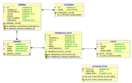

# Duck Bill

Aplicação Spring Boot para controle de despesas pessoais, metas de poupança, tarefas com alertas temporais e investimentos, com frontend Thymeleaf, Spring Security e Flyway.

## Integrantes
- Bruno Carlos Soares RM 559250 - Responsável pelos testes funcionais e validação dos endpoints.
- Lucas Borges de Souza RM 560027 - Desenvolvimento completo da aplicação Spring Boot, controllers e serviços.
- Pedro Henrique Rodrigues RM 560393 - Criação da documentação, diagramas e README do projeto.

## Repositório
- GitHub: `https://github.com/Lucas-Borges27/duckbill-JAVA`

## Pré-requisitos
- Java 17+
- Preferencialmente usar `./mvnw`
- Acesso ao Oracle FIAP em `oracle.fiap.com.br:1521/orcl`
- Se necessário, rede/VPN com resolução do host `oracle.fiap.com.br`

## Como rodar

### Execução
1. Clone o repositório.
2. Exporte as variáveis:
   `DB_USER`
   `DB_PASSWORD`
3. Execute: `./mvnw spring-boot:run`
4. O Flyway criará/versionará o schema e aplicará as migrations.
5. A aplicação usa a URL fixa `jdbc:oracle:thin:@oracle.fiap.com.br:1521:orcl`.

### Testes
- Execute: `./mvnw test`
- Os testes usam a mesma configuração Oracle da aplicação e dependem de `DB_USER` e `DB_PASSWORD`.
- Se o host Oracle não estiver acessível na rede da máquina, o teste de contexto irá falhar.
- Para validar rapidamente os fluxos principais sem depender da suíte inteira, execute:
  `./mvnw -q -Dtest=DashboardServiceTest,MetaServiceTest,TarefaFinanceiraServiceTest test`

## Acesso
- Web: `http://localhost:8080/login`

### Credenciais seed
- Admin: `admin@duckbill.com` / `admin123`
- User: `user@duckbill.com` / `user123`

### Rotas web principais
- `/login`
- `/app/dashboard`
- `/app/despesas/nova`
- `/app/transacoes/nova`
- `/admin/categorias`
- `/acesso-negado`

### Fluxos recomendados para demonstração
- USER: login, dashboard mensal, criação/edição de despesa e impacto nos insights.
- USER: criação de transação de ativo e leitura do resumo consolidado da carteira.
- API JWT: login, leitura de `/api/v1/me`, metas, tarefas/notificações e despesas.
- ADMIN: tentativa de exclusão de categoria em uso e bloqueio funcional.

## Diagramas
### DER


### Diagrama de Classes


## Vídeo
- URL : [https://youtu.be/3hpxwZli2kY?si=s6yuTLSgUr45mRD_](https://youtu.be/3hpxwZli2kY?si=s6yuTLSgUr45mRD_)

## Endpoints principais
- Auth: POST `/api/v1/auth/login`, POST `/api/v1/auth/register`, GET `/api/v1/me`
- Usuários admin: POST/GET `/api/v1/usuarios`, GET `/api/v1/usuarios/{id}`
- Categorias: POST/GET /api/v1/categorias
- Despesas: POST/GET `/api/v1/despesas`, GET/PUT/DELETE `/api/v1/despesas/{id}`, GET `/api/v1/despesas/top3`, GET `/api/v1/despesas/insights`
- Metas: POST/GET `/api/v1/metas`, GET/PUT/DELETE `/api/v1/metas/{id}`, POST `/api/v1/metas/{id}/aportes`
- Tarefas: POST/GET `/api/v1/tarefas`, GET/PUT/DELETE `/api/v1/tarefas/{id}`, GET `/api/v1/tarefas/notificacoes`, POST `/api/v1/tarefas/{id}/concluir`
- Ativos: POST/GET /api/v1/ativos, GET /api/v1/ativos/{id}, PUT /api/v1/ativos/{id}
- Transações Ativo: POST/GET `/api/v1/transacoes-ativo`, GET `/api/v1/transacoes-ativo/{id}`, PUT `/api/v1/transacoes-ativo/{id}`, DELETE `/api/v1/transacoes-ativo/{id}`, GET `/api/v1/transacoes-ativo/resumo`
- Cotações de Ativo: POST/GET /api/v1/cotacoes-ativo, GET /api/v1/cotacoes-ativo/{ativoId}/{dataRef}
- Cotações de Moeda: GET /api/v1/cotacoes-moeda, GET /api/v1/cotacoes-moeda/{moeda}/{dataRef}
- Câmbio (serviço utilitário): GET /api/v1/cambio

## Postman
Para testar os endpoints da API, importe a coleção do Postman localizada em `docs/postman/duckBill-postman.json`. A coleção inclui exemplos de requisições para todos os endpoints principais.

## Autenticação da API
As rotas `/api/**` usam JWT Bearer Token. O frontend web em Thymeleaf continua com login por formulário e sessão, mas o app mobile consome apenas a API JWT.

```bash
curl -X POST http://localhost:8080/api/v1/auth/login \
  -H "Content-Type: application/json" \
  -d '{"email":"user@duckbill.com","senha":"user123"}'
```

Resposta esperada:

```bash
{
  "token": "eyJ...",
  "tokenType": "Bearer",
  "expiresIn": 86400,
  "usuario": {
    "id": 2,
    "nome": "Usuário Padrão",
    "email": "user@duckbill.com",
    "role": "ROLE_USER",
    "saldo": 2500.00
  }
}
```

## Exemplos de uso
Os exemplos abaixo assumem um token JWT válido em `TOKEN`. Para rotas administrativas, faça login com `admin@duckbill.com`.

### 1. Criar usuário
```bash
curl -X POST http://localhost:8080/api/v1/usuarios \
  -H "Authorization: Bearer $TOKEN" \
  -H "Content-Type: application/json" \
  -d '{"nome":"João Silva","email":"joao@example.com","senha":"senha123","role":"ROLE_USER"}'
```

### 2. Criar categoria
```bash
curl -X POST http://localhost:8080/api/v1/categorias \
  -H "Authorization: Bearer $TOKEN" \
  -H "Content-Type: application/json" \
  -d '{"nome":"Alimentacao"}'
```

### 3. Criar despesa
```bash
curl -X POST http://localhost:8080/api/v1/despesas \
  -H "Authorization: Bearer $TOKEN" \
  -H "Content-Type: application/json" \
  -d '{"categoriaId":1,"valor":50.00,"moeda":"BRL","dataCompra":"2026-03-10","descricao":"Jantar"}'
```

### 4. Listar despesas do mês
```bash
curl -H "Authorization: Bearer $TOKEN" \
  "http://localhost:8080/api/v1/despesas?mes=2026-03"
```

### 5. Top 3 categorias por gasto
```bash
curl -H "Authorization: Bearer $TOKEN" \
  "http://localhost:8080/api/v1/despesas/top3?mes=2026-03"
```

### 6. Insights básicos
```bash
curl -H "Authorization: Bearer $TOKEN" \
  "http://localhost:8080/api/v1/despesas/insights?mes=2026-03"
```

### 7. Converter moeda
```bash
curl -H "Authorization: Bearer $TOKEN" \
  "http://localhost:8080/api/v1/cambio?from=USD&to=BRL&valor=100"
```

### 8. Criar meta
```bash
curl -X POST http://localhost:8080/api/v1/metas \
  -H "Authorization: Bearer $TOKEN" \
  -H "Content-Type: application/json" \
  -d '{"titulo":"Notebook novo","valorObjetivo":4500,"valorGuardado":0,"icone":"laptop","corDestaque":"#67c1ff"}'
```

### 9. Criar tarefa financeira
```bash
curl -X POST http://localhost:8080/api/v1/tarefas \
  -H "Authorization: Bearer $TOKEN" \
  -H "Content-Type: application/json" \
  -d '{"titulo":"Pagar cartão","descricao":"Fechar a fatura do mês","valorEstimado":650,"dataLimite":"2026-04-02","notificarEm":"2026-04-01T18:00:00","status":"PENDENTE"}'
```

### 10. Criar ativo
```bash
curl -X POST http://localhost:8080/api/v1/ativos \
  -H "Authorization: Bearer $TOKEN" \
  -H "Content-Type: application/json" \
  -d '{"ticker":"PETR4.SA","tipo":"STOCK","moedaBase":"BRL"}'
```

### 11. Criar transação de ativo
```bash
curl -X POST http://localhost:8080/api/v1/transacoes-ativo \
  -H "Authorization: Bearer $TOKEN" \
  -H "Content-Type: application/json" \
  -d '{"usuarioId":2,"ativoId":1,"tipo":"BUY","qtd":10.0,"preco":25.50,"dataNegocio":"2026-03-10"}'
```

### 12. Buscar cotação de moeda
```bash
curl -H "Authorization: Bearer $TOKEN" \
  "http://localhost:8080/api/v1/cotacoes-moeda/USD/2026-03-10"
```

## Evolução do Projeto

### Sprint 1 (Maturity Level 1 - Recursos)
- Implementação das entidades básicas (Usuario, Categoria, Despesa, Ativo, TransacaoAtivo, CotacaoAtivo, CotacaoMoeda).
- CRUD básico para todas as entidades.
- Persistência com JPA/Hibernate e Oracle Database.
- Validações básicas com Bean Validation.
- Testes funcionais com Postman.

### Sprint 2 (Maturity Level 3 - Hypermedia Controls)
- Evolução inicial da API com Spring HATEOAS.
- Melhorias na arquitetura: separação em camadas (Controller, Service, Repository, Mapper, DTO).
- Validações aprimoradas e tratamento de erros global.
- Coleção Postman atualizada para refletir as mudanças.

### Sprint 3 (Java Advanced - Web + Security + Flyway)
- Frontend web com Thymeleaf e telas funcionais.
- Autenticação por formulário (Spring Security) e senha BCrypt.
- API REST em JSON simplificado para integração com React Native.
- Autenticação JWT para `/api/**` com endpoint de login, cadastro e `/api/v1/me`.
- Perfis `ROLE_USER` e `ROLE_ADMIN` com autorização por rotas.
- Fluxo A: Dashboard mensal com total, top 3 e insights (regra no service).
- Fluxo B: Metas de poupança com CRUD e aporte incremental.
- Fluxo C: Relógio de Ouro com tarefas, janela de notificação e conclusão.
- Fluxo D: Investimentos com formulário, histórico de transações e resumo consolidado da carteira.
- Fluxo E: Admin bloqueia exclusão de categoria com despesas vinculadas.
- Migrações Flyway V1 (schema), V2 (seed), V3 (ajuste de identities), V4 (saldo do usuário) e V5 (metas + tarefas).

## Roteiro do vídeo
Consulte `docs/roteiro-video.md`.

## Checklist rápido de demonstração
- Flyway aplicado com migrations `V1` a `V5`
- Login web funcionando em `/login`
- USER sem acesso a `/admin/**`
- ADMIN com acesso a `/admin/categorias`
- Dashboard exibindo total, top 3 e insights
- Despesa criada refletindo no dashboard
- Transação de ativo refletindo na carteira
- Endpoints JWT respondendo com JSON e protegidos por perfil

## Material para avaliação oral e vídeo
- README com instalação, execução e acesso.
- Diagramas em `docs/images`.
- Roteiro em `docs/roteiro-video.md`.
- Coleção Postman em `docs/postman/duckBill-postman.json`.
- Credenciais seed para perfis USER e ADMIN.

## Configuração centralizada
Toda a configuração da aplicação está em `src/main/resources/application.properties`.
Variáveis adicionais da API:
- `JWT_SECRET`
- `JWT_EXPIRATION_MS`
- `APP_CORS_ALLOWED_ORIGINS`
